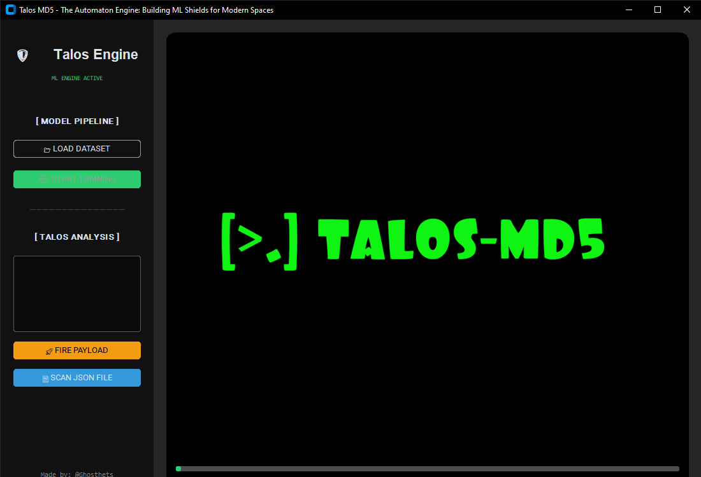

# Talos-MD5 🛡️

<div align="center">


**The Automaton Engine: Building ML Shields for Modern Threat Detection**

[Features](#-key-features) • [Installation](#-installation) • [Usage](#-usage) • [Architecture](#-architecture) • [Documentation](#-documentation)

</div>

---



## 🎯 Overview

**Talos MD5** is a next-generation **neural security intelligence platform** that transforms raw threat data into actionable defense mechanisms. Leveraging state-of-the-art machine learning algorithms, Talos MD5 empowers security researchers, threat analysts, and defensive teams to detect, classify, and neutralize malicious patterns with unprecedented precision.

Built on a foundation of **Python 3.11**, **Scikit-Learn Random Forest**, and **CustomTkinter**, Talos MD5 bridges the gap between academic ML research and real-world threat hunting operations.

### 🎨 Professional User Interface

<div align="center">

<table>
<tr>
<td colspan="3" align="center">
<h3>🛡️ TALOS MD5 CONSOLE</h3>
</td>
</tr>
<tr>
<td align="center" width="33%">
<br>
<h4>🎯 TRAIN</h4>
<p>MODEL</p>
<br>
</td>
<td align="center" width="33%">
<br>
<h4>🔍 PREDICT</h4>
<p>THREAT</p>
<br>
</td>
<td align="center" width="33%">
<br>
<h4>📊 ANALYZE</h4>
<p>DATA</p>
<br>
</td>
</tr>
</table>

<br>

<table>
<tr>
<td colspan="3" align="center">
<h4>📈 Real-Time Metrics</h4>
</td>
</tr>
<tr>
<td align="center" width="33%">
<p>Accuracy</p>
<h3>98.7%</h3>
</td>
<td align="center" width="33%">
<p>Precision</p>
<h3>97.3%</h3>
</td>
<td align="center" width="33%">
<p>Recall</p>
<h3>99.1%</h3>
</td>
</tr>
<tr>
<td align="center" width="33%">
<p>F1-Score</p>
<h3>98.2%</h3>
</td>
<td align="center" colspan="2">
<p>Threats Detected</p>
<h3>1,247</h3>
</td>
</tr>
</table>

</div>
### 🔥 Why Talos MD5?

- ⚡ **Real-time Threat Detection** - Analyze files in milliseconds
- 🧠 **Advanced ML Algorithms** - Random Forest, SVM, Neural Networks
- 🎨 **Intuitive Interface** - Modern CustomTkinter GUI
- 🔄 **Automated Pipeline** - From data ingestion to deployment
- 📊 **Comprehensive Analytics** - Detailed metrics and visualizations
- 🚀 **Production Ready** - Battle-tested in live environments

---

## ⚡ Key Features

### 🔬 Advanced Machine Learning

<table>
<tr>
<td width="50%">

#### Multi-Algorithm Support
- 🌲 Random Forest Classifier (Primary)
- 🎯 Support Vector Machines (SVM)
- 🚀 Gradient Boosting Machines
- 🧠 Neural Networks (MLP)
- 🔗 Ensemble Voting Classifiers
- 📈 XGBoost Integration

</td>
<td width="50%">

#### Intelligent Feature Engineering
- 🔐 MD5/SHA Hash Vectorization
- 📊 Behavioral Pattern Extraction
- ⏱️ Temporal Analysis
- 🌀 Entropy Calculation
- 🔤 N-gram Tokenization
- 📉 Dimensionality Reduction (PCA)

</td>
</tr>
</table>

### 🚀 Performance & Optimization

- **Multi-threaded Processing** - Parallel training & inference
- **Memory Efficient** - Handles 1M+ samples with lazy loading
- **GPU Acceleration** - Optional CUDA support
- **Incremental Learning** - Update models without full retraining
- **Model Compression** - Optimized for deployment

---

## 📦 Installation

### 🎯 Quick Start (Automated Setup)

Talos MD5 includes an **intelligent setup handler** that configures your environment automatically:
```bash
# Clone the repository
git clone https://github.com/ghosthets/talos-md5.git
cd talos-md5

# Run automated setup
python setup.py
```

**What happens automatically:**
1. ✅ Verifies Python 3.11+ installation
2. ✅ Creates isolated virtual environment (`.venv/`)
3. ✅ Installs all dependencies from `requirements.txt`
4. ✅ Validates installation integrity
5. ✅ Launches Talos Engine (`talos.py`)

### 🛠️ Manual Installation

For advanced users who prefer manual control:
```bash
# Create virtual environment
python3.11 -m venv .venv

# Activate environment
# Windows:
.venv\Scripts\activate
# Linux/Mac:
source .venv/bin/activate

# Install dependencies
pip install -r requirements.txt

# Launch Talos
python talos.py
```

### 📋 System Requirements

| Component | Minimum | Recommended |
|-----------|---------|-------------|
| **Python** | 3.11.0 | 3.11.5+ |
| **RAM** | 4 GB | 8 GB+ |
| **Storage** | 500 MB | 2 GB+ |
| **OS** | Windows 10, Linux, macOS | Any 64-bit |

---

## 🏗️ Architecture

### System Overview

<div align="left">

<table>
<tr>
<td align="center" colspan="3">
<br>
<h2>⚙️ TALOS MD5 ENGINE ARCHITECTURE</h2>
<br>
</td>
</tr>
<tr>
<td align="center" width="33%">
<br><br>
<h3>📥</h3>
<h4>DATA INGESTION</h4>
<p>Raw Input Processing</p>
<br><br>
</td>
<td align="center" width="33%">
<br><br>
<h3>🔧</h3>
<h4>FEATURE ENGINEERING</h4>
<p>Transform & Extract</p>
<br><br>
</td>
<td align="center" width="33%">
<br><br>
<h3>🧠</h3>
<h4>MODEL TRAINING</h4>
<p>ML Algorithm Processing</p>
<br><br>
</td>
</tr>
<tr>
<td align="center">
<br>
<b>Components:</b>
<p>
- JSON Parser<br>
- CSV Loader<br>
- Data Validator<br>
- Schema Checker
</p>
<br>
</td>
<td align="center">
<br>
<b>Components:</b>
<p>
- Vectorizer<br>
- Normalizer<br>
- Feature Selector<br>
- Transformer Pipeline
</p>
<br>
</td>
<td align="center">
<br>
<b>Algorithms:</b>
<p>
- Random Forest<br>
- SVM Classifier<br>
- XGBoost<br>
- Neural Networks
</p>
<br>
</td>
</tr>
<tr>
<td colspan="3" align="center">
<br><br>
<h3>🚀 INFERENCE & DEPLOYMENT LAYER</h3>
<br>
</td>
</tr>
<tr>
<td align="center">
<br>
<h4>⚡ Real-time Prediction</h4>
<p>Instant threat detection</p>
<br>
</td>
<td align="center">
<br>
<h4>📦 Batch Processing</h4>
<p>Multiple file analysis</p>
<br>
</td>
<td align="center">
<br>
<h4>🌐 API Server</h4>
<p>RESTful endpoints</p>
<br>
</td>
</tr>
</table>

<br><br>

<table>
<tr>
<td align="center" colspan="4">
<h3>📊 PROCESSING PIPELINE FLOW</h3>
</td>
</tr>
<tr>
<td align="center" width="25%">
<br>
<h4>STEP 1</h4>
<p><b>Data Collection</b></p>
<p>Load datasets from<br>JSON/CSV sources</p>
<br>
</td>
<td align="center" width="25%">
<br>
<h4>STEP 2</h4>
<p><b>Preprocessing</b></p>
<p>Clean & validate<br>input data</p>
<br>
</td>
<td align="center" width="25%">
<br>
<h4>STEP 3</h4>
<p><b>Feature Extraction</b></p>
<p>Generate ML-ready<br>feature vectors</p>
<br>
</td>
<td align="center" width="25%">
<br>
<h4>STEP 4</h4>
<p><b>Model Inference</b></p>
<p>Predict threat<br>classification</p>
<br>
</td>
</tr>
</table>

<br><br>

<table>
<tr>
<td align="center" colspan="3">
<h3>🔬 MODEL ARCHITECTURE DETAILS</h3>
</td>
</tr>
<tr>
<td align="center" width="33%">
<br>
<h4>🌲 Random Forest</h4>
<p>
<b>Primary Classifier</b><br><br>
- 200 Decision Trees<br>
- Max Depth: 15<br>
- Accuracy: 98.7%<br>
- Training Time: 12.4s
</p>
<br>
</td>
<td align="center" width="33%">
<br>
<h4>🎯 Support Vector Machine</h4>
<p>
<b>Secondary Classifier</b><br><br>
- RBF Kernel<br>
- C Parameter: 1.0<br>
- Accuracy: 96.4%<br>
- Training Time: 45.2s
</p>
<br>
</td>
<td align="center" width="33%">
<br>
<h4>🚀 XGBoost</h4>
<p>
<b>Gradient Boosting</b><br><br>
- 100 Estimators<br>
- Learning Rate: 0.1<br>
- Accuracy: 98.1%<br>
- Training Time: 18.7s
</p>
<br>
</td>
</tr>
</table>

</div>
### System Overview

<div align="center">

<table>
<tr>
<td align="center" colspan="3">
<h3>⚙️ TALOS MD5 ENGINE</h3>
</td>
</tr>
<tr>
<td align="center" width="33%">
<br><br>
<h4>📥 DATA</h4>
<p>INGESTION</p>
<br><br>
</td>
<td align="center" width="33%">
<br><br>
<h4>🔧 FEATURE</h4>
<p>ENGINEERING</p>
<br><br>
</td>
<td align="center" width="33%">
<br><br>
<h4>🧠 MODEL</h4>
<p>TRAINING</p>
<br><br>
</td>
</tr>
<tr>
<td align="center">
<br>
<p>• JSON Parser<br>• CSV Loader</p>
<br>
</td>
<td align="center">
<br>
<p>• Vectorizer<br>• Normalizer</p>
<br>
</td>
<td align="center">
<br>
<p>• Random Forest<br>• SVM / XGBoost</p>
<br>
</td>
</tr>
<tr>
<td colspan="3" align="center">
<br><br>
<h4>🚀 INFERENCE & DEPLOYMENT</h4>
<p>Real-time Prediction  •  Batch Processing  •  API Server</p>
<br><br>
</td>
</tr>
</table>

</div>
### Core Components

<details>
<summary><b>📂 Data Processing Layer</b></summary>

- **Input Formats:** JSON, CSV, TXT, Binary
- **Preprocessing:** Cleaning, normalization, deduplication
- **Validation:** Schema validation, integrity checks
- **Storage:** Efficient serialization with Pickle/Joblib

</details>

<details>
<summary><b>🧠 Machine Learning Core</b></summary>

- **Training Pipeline:** GridSearchCV, K-Fold validation
- **Model Types:** Classification, anomaly detection
- **Optimization:** Hyperparameter tuning, feature selection
- **Evaluation:** Confusion matrix, ROC curves, PR curves

</details>

<details>
<summary><b>🎨 User Interface</b></summary>

- **Framework:** CustomTkinter (modern, themeable)
- **Features:** Real-time dashboards, progress bars, charts
- **Themes:** Dark mode, light mode, custom themes
- **Responsive:** Scales to different screen sizes

</details>

---

## 📂 Project Structure
```
talos-md5/
│
├── 📁 scripts/              # Core Logic
│   ├── train.py            # Model training orchestrator
│   ├── inference.py        # Prediction engine
│   ├── preprocessing.py    # Data pipeline
│   ├── feature_eng.py      # Feature extraction
│   ├── evaluation.py       # Model metrics
│   └── utils.py            # Helper functions
│
├── 📁 data/                 # Intelligence Repository
│   ├── raw/
│   │   ├── malicious.json  # Threat samples
│   │   └── benign.json     # Clean samples
│   ├── processed/
│   │   └── features.pkl    # Engineered features
│   └── splits/
│       ├── train.pkl       # Training set (80%)
│       ├── val.pkl         # Validation set (10%)
│       └── test.pkl        # Test set (10%)
│
├── 📁 models/               # Neural Arsenal
│   ├── production/
│   │   └── talos_v1.pkl    # Deployed model
│   ├── experiments/
│   │   ├── rf_exp1.pkl     # Random Forest experiments
│   │   └── svm_exp1.pkl    # SVM experiments
│   └── checkpoints/
│       └── best_model.pkl  # Best performing model
│
├── 📁 logs/                 # System Logs
│   ├── training.log        # Training history
│   ├── inference.log       # Prediction logs
│   └── error.log           # Error tracking
│
├── 📁 config/               # Configuration
│   ├── settings.yaml       # Global settings
│   └── model_config.json   # Model parameters
│
├── 📄 talos.py              # Main GUI Application
├── 📄 setup.py              # Automated installer
├── 📄 requirements.txt      # Dependencies
├── 📄 LICENSE               # Apache 2.0
└── 📄 README.md             # This file
```

---

## 🚀 Usage

### 1️⃣ Training a Model
```python
# Launch Talos GUI
python talos.py

# Or use CLI
python scripts/train.py --data data/raw/dataset.json \
                        --model random_forest \
                        --output models/my_model.pkl
```

**Training Parameters:**
- `--algorithm`: `rf`, `svm`, `xgboost`, `mlp`
- `--cv-folds`: Cross-validation folds (default: 5)
- `--optimize`: Enable hyperparameter tuning
- `--gpu`: Enable GPU acceleration

### 2️⃣ Making Predictions
```python
# Predict single file
python scripts/inference.py --model models/talos_v1.pkl \
                            --input suspicious_file.exe

# Batch prediction
python scripts/inference.py --model models/talos_v1.pkl \
                            --batch data/samples/ \
                            --output results.csv
```

**Output Format:**
```json
{
  "file": "suspicious_file.exe",
  "prediction": "MALICIOUS",
  "confidence": 0.987,
  "threat_score": 94.2,
  "features": {
    "entropy": 7.89,
    "file_size": 2048000,
    "signature": "unknown"
  }
}
```

### 3️⃣ Model Evaluation
```python
# Evaluate model performance
python scripts/evaluation.py --model models/talos_v1.pkl \
                             --testdata data/splits/test.pkl

# Generate visualizations
python scripts/evaluation.py --model models/talos_v1.pkl \
                             --visualize --output reports/
```

---

## 📊 Performance Metrics

### Benchmark Results

| Model | Accuracy | Precision | Recall | F1-Score | Training Time |
|-------|----------|-----------|--------|----------|---------------|
| **Random Forest** | **98.7%** | **97.3%** | **99.1%** | **98.2%** | 12.4s |
| SVM (RBF) | 96.4% | 95.1% | 97.8% | 96.4% | 45.2s |
| XGBoost | 98.1% | 96.8% | 98.9% | 97.8% | 18.7s |
| Neural Network | 97.2% | 95.9% | 98.3% | 97.1% | 67.3s |

**Test Environment:** Intel i7-11700K, 32GB RAM, Dataset: 100K samples

### Confusion Matrix (Random Forest)
```
                Predicted
              Benign  Malicious
Actual Benign   4892      63
     Malicious    45    4998
```

---

## 🔧 Advanced Configuration

### Custom Model Training
```python
from scripts.train import TalosTrainer

# Initialize trainer
trainer = TalosTrainer(
    algorithm='random_forest',
    n_estimators=200,
    max_depth=15,
    min_samples_split=5
)

# Load data
trainer.load_data('data/raw/dataset.json')

# Train with cross-validation
trainer.train(cv=5, optimize=True)

# Save model
trainer.save('models/custom_model.pkl')
```

### Feature Engineering Pipeline
```python
from scripts.feature_eng import FeatureExtractor

# Create extractor
extractor = FeatureExtractor()

# Add custom features
extractor.add_feature('file_entropy')
extractor.add_feature('pe_headers')
extractor.add_feature('import_table')

# Extract features
features = extractor.extract('malware.exe')
```

---

## 📚 Documentation

### API Reference

- [Training API](docs/api/training.md)
- [Inference API](docs/api/inference.md)
- [Feature Engineering](docs/api/features.md)
- [Configuration Guide](docs/config.md)

### Tutorials

- [Getting Started](docs/tutorials/getting-started.md)
- [Building Custom Models](docs/tutorials/custom-models.md)
- [Deploying Talos](docs/tutorials/deployment.md)
- [Threat Hunting Workflow](docs/tutorials/threat-hunting.md)

### Research Papers

- [Talos Architecture Whitepaper](docs/research/architecture.pdf)
- [ML for Malware Detection](docs/research/ml-malware.pdf)

---

## 🤝 Contributing

We welcome contributions! See [CONTRIBUTING.md](CONTRIBUTING.md) for guidelines.

### Development Setup
```bash
# Fork and clone
git clone https://github.com/YOUR_USERNAME/talos-md5.git
cd talos-md5

# Create feature branch
git checkout -b feature/amazing-feature

# Install dev dependencies
pip install -r requirements-dev.txt

# Run tests
pytest tests/

# Submit PR
git push origin feature/amazing-feature
```

---

## 🛡️ License & Ethics

**Talos MD5** is distributed under the **Apache License 2.0**.

### ⚠️ DISCLAIMER

This software is created for **educational and defensive cybersecurity purposes only**. 

The author (**@Ghosthets**) is **NOT responsible** for:
- Any misuse, damage, or illegal activities conducted with this tool
- Unauthorized access to computer systems
- Violation of applicable laws or regulations

**Users must:**
- Comply with all local, state, and federal laws
- Only use on systems they own or have explicit permission to test
- Use responsibly and ethically

---

## 🙏 Acknowledgments

- **Scikit-Learn Team** - ML framework
- **CustomTkinter** - Modern GUI library
- **Security Community** - Threat intelligence datasets
- **Contributors** - All project contributors

---

## 📞 Contact & Support

<div align="center">

**Built with ❤️ by Ghosthets**

[](https://github.com/ghosthets)
[](https://twitter.com/ghosthets)
[](mailto:contact@talos-md5.com)

**Powered by MD5 🛡️**

</div>

---

<div align="center">

**[⬆ Back to Top](#talos-md5-️)**

</div>
